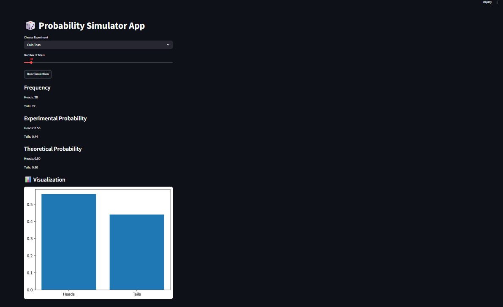
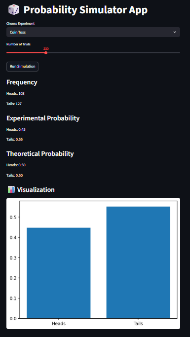
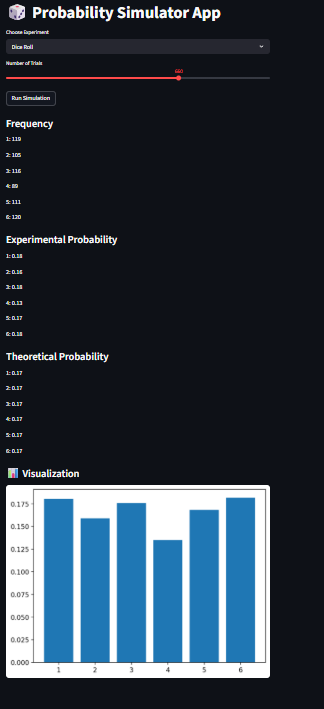

# 🎲 Probability Simulator App

An interactive Streamlit web application to simulate probability experiments like coin toss and dice roll, and compare theoretical and experimental probabilities.

---

## 🚀 Features

* Select experiment (Coin Toss / Dice Roll)
* Choose number of trials
* View frequency of outcomes
* Calculate experimental probability
* Compare with theoretical probability
* Visualize results using bar chart

---

## 🛠️ Technologies Used

* Python
* Streamlit
* Matplotlib
* Random module

---

## 📂 How to Run the Project

1. Clone the repository

2. Install dependencies:
   pip install streamlit matplotlib

3. Run the app:
   streamlit run app.py

---

## 📸 Screenshots

### 🔹 1. App Interface

### 🔹 2. Coin Toss Simulation

### 🔹 3. Dice Roll Simulation

---

## 🧠 Concepts Used

* Probability Theory
* Theoretical Probability
* Experimental Probability
* Law of Large Numbers
* Simulation Techniques

---
